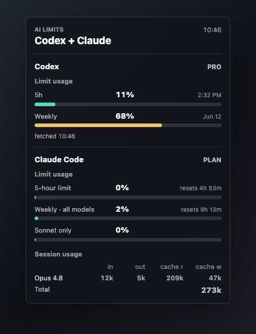

# AI Limits Übersicht 桌面组件

一个用于 [Übersicht](https://tracesof.net/uebersicht/) 的 macOS 桌面组件，用来在一个紧凑面板里同时显示 Codex 和 Claude Code 的 limit 使用情况。

英文版：[README.md](README.md)



截图使用的是示例数值。组件里所有 limit 行都按 **已使用额度百分比** 展示。

## 显示内容

- Codex：从 ChatGPT/Codex 官方 `/wham/usage` 接口读取 5 小时和 weekly limit 使用量。
- Claude Code：从 Claude 用量接口读取 5 小时、weekly all-models、Sonnet-only limit 使用量。
- Claude Code session token：从本地日志汇总最近 session 的 input/output/cache token。

## 读取来源

- Codex 登录信息：`~/.codex/auth.json`
- Codex 用量接口：`https://chatgpt.com/backend-api/wham/usage`
- Claude Desktop Cookie：`~/Library/Application Support/Claude/Cookies`
- Claude 钥匙串条目：`Claude Safe Storage`
- Claude Code 日志：`~/.claude/projects/**/*.jsonl`
- 本地缓存：`~/.cache/ai-limits/`

这个仓库不会保存你的 token。组件只会在运行时读取本机登录状态，并调用显示用量所需的官方接口。

## 前置条件

1. macOS，并已安装 Übersicht。
2. 目标 Mac 上 Codex 已用 ChatGPT 登录。
3. 目标 Mac 上 Claude Desktop 已登录。
4. Claude Code 至少使用过一次，这样 `~/.claude` 里才会有本地日志。
5. Python 3。
6. `ccusage`，用于汇总 Claude Code 本地 session token。

推荐安装：

```bash
brew install --cask ubersicht
brew install bun
bun install -g ccusage
```

## 安装

```bash
git clone git@github.com:XinDongol/ubersicht-token-widget.git
cd ubersicht-token-widget
./install.sh
```

安装脚本会把组件复制到：

```bash
~/Library/Application Support/Übersicht/widgets/ai-limits.widget
```

它还会在 widget 目录里创建本地 Python 虚拟环境，并安装 `requirements.txt` 里的依赖。

如果 Übersicht 没有运行，手动打开：

```bash
open -a "Übersicht"
```

## 验证

手动运行组件脚本：

```bash
cd "$HOME/Library/Application Support/Übersicht/widgets/ai-limits.widget"
./.venv/bin/python ./ai_limits.py
```

正常情况下会输出包含 `Codex` 和 `Claude Code` 两个区域的 HTML。

刷新组件：

```bash
osascript -e 'tell application "Übersicht" to reload widget id "ai-limits-widget-index-coffee"'
```

## 更新

```bash
cd ubersicht-token-widget
git pull
./install.sh
```

## 排障

如果 Codex 显示 `offline`，在那台 Mac 上重新登录：

```bash
codex login
ls ~/.codex/auth.json
```

如果 Claude 用量不可用，确认 Claude Desktop 已登录，并重新安装 widget 依赖：

```bash
open -a Claude
cd "$HOME/Library/Application Support/Übersicht/widgets/ai-limits.widget"
./.venv/bin/python -m pip install -r requirements.txt
```

如果 Claude Code session token 不显示：

```bash
bun install -g ccusage
ccusage --version
```

如果 `ccusage` 安装在非标准路径，设置：

```bash
export CCUSAGE_BIN="/absolute/path/to/ccusage"
```

如果你使用非默认配置目录：

```bash
export CODEX_HOME="$HOME/.codex"
export CLAUDE_CONFIG_DIR="$HOME/.claude"
```

然后重启 Übersicht。

## 卸载

```bash
rm -rf "$HOME/Library/Application Support/Übersicht/widgets/ai-limits.widget"
```
